# MedTask
### Projeto desenvolvido com a framework QT Creator para a disciplina de Técnicas de Programação 2018.2. MedTask permite que você gerencie de maneira simples o atendimento de pacientes em um ambiente hospitalar. 

O MedTask tem a intenção de tornar a realização de tarefas de agendamento mais prática e fácil em hospitais. 
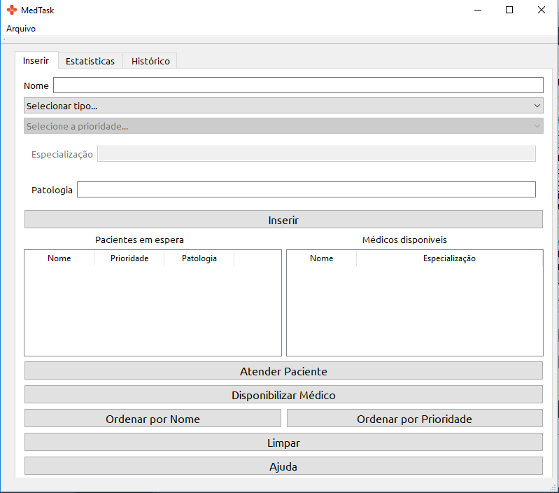
Como tela inicial, pode-se cadastrar dois tipos de usuários: pacientes e médicos. Para os pacientes, há a possibilidade de determinar seu nome, sua prioridade de atendimento (em alta, média ou baixa), além de sua patologia. Já para os médicos, pode-se cadastrar seu nome e sua especialização. 
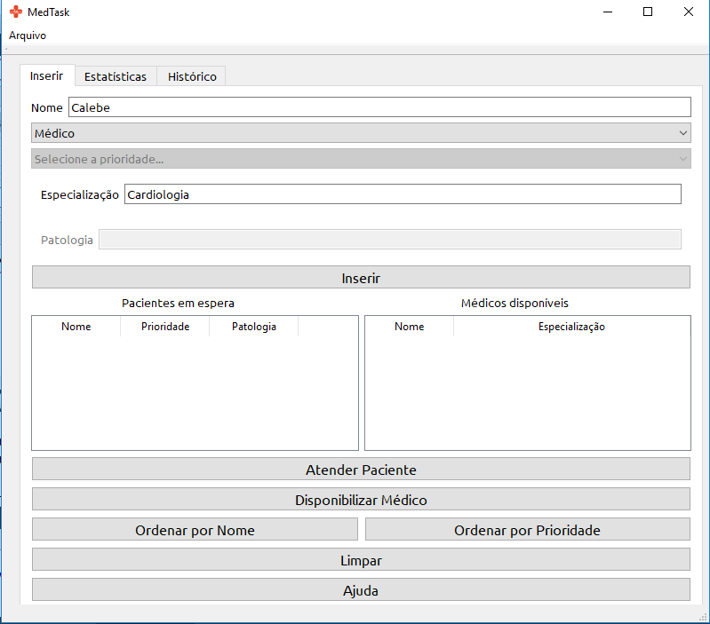
Para inserir o usuário, basta clicar uma vez no botão "Inserir".
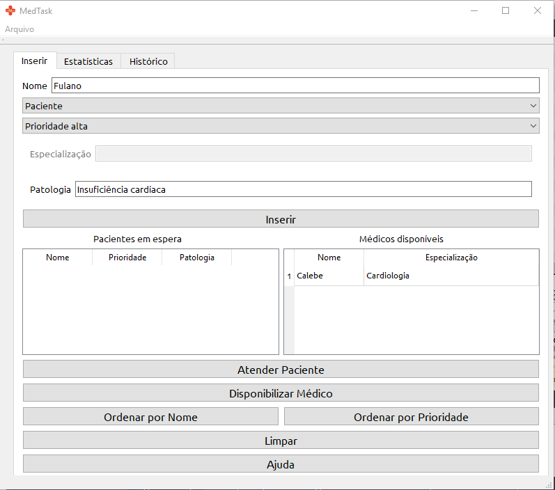
Uma outra alternativa é carregar os dados de pacientes e médicos a partir de um arquivo do tipo .txt, como também salvá-los. Para carregar, basta apertar a tecla B ou ir na barra superior e localizar Arquivos -> Carregar. Para salvar, basta apertar as teclas Ctrl+S ou localizar Arquivos -> Salvar. Em ambos os casos, aparecerá uma janela para abrir ou criar o arquivo.
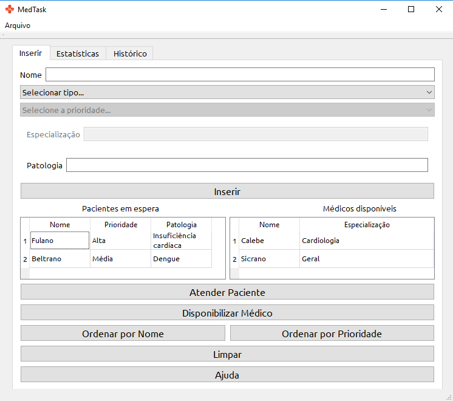
Além disso, as opções Ordenar por Nome e Ordenar por Prioridade possibilitam configurar as tabelas para a ordem crescente de nome e decrescente de prioridade (esta disponível apenas para usuários do tipo paciente). 
A opção Limpar permite a varredura instantânea dos usuários e, consequentemente, de seus dados.
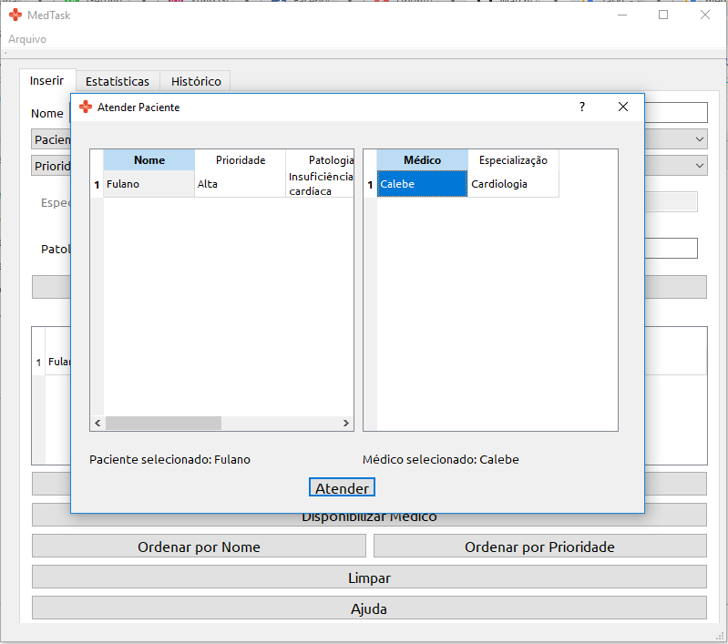
Para atender a um paciente, basta clicar na opção Atender. Em seguida, será aberta uma janela de atendimento, no qual será fornecida duas tabelas. A primeira tabela será de pacientes na lista de espera, e a segunda será de médicos disponíveis para consulta. Ao clicar duas vezes em um paciente da primeira tabela e também duas vezes em um paciente na segunda tabela, você poderá realizar o cadastro do atendimento, ao clicar no botão Atender logo em seguida. 
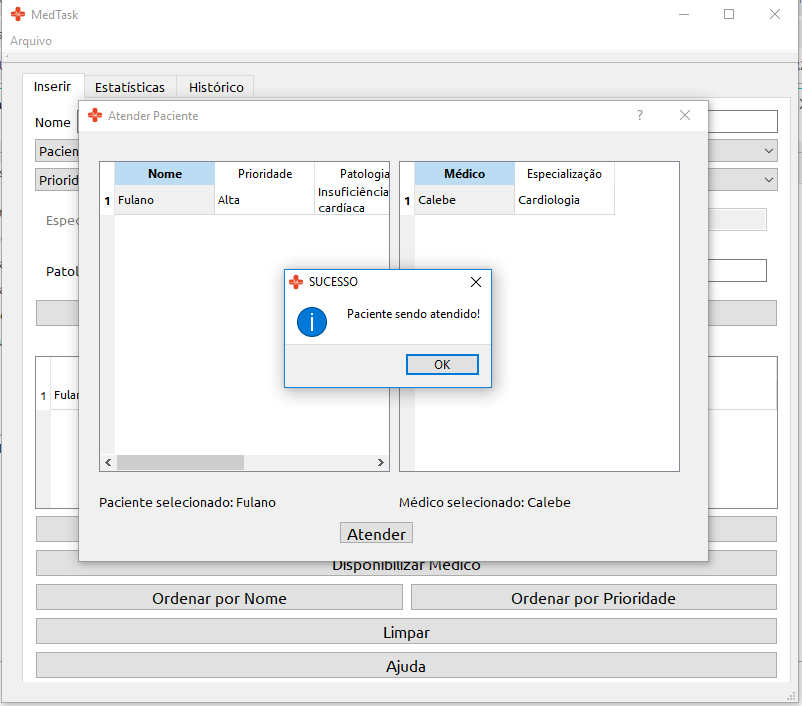
Um cenário comum é de pacientes esperando médicos ficarem disponíveis para atendimento. Quando o médico puder atender o paciente, podemos solicitar a opção Disponibilizar Médico.
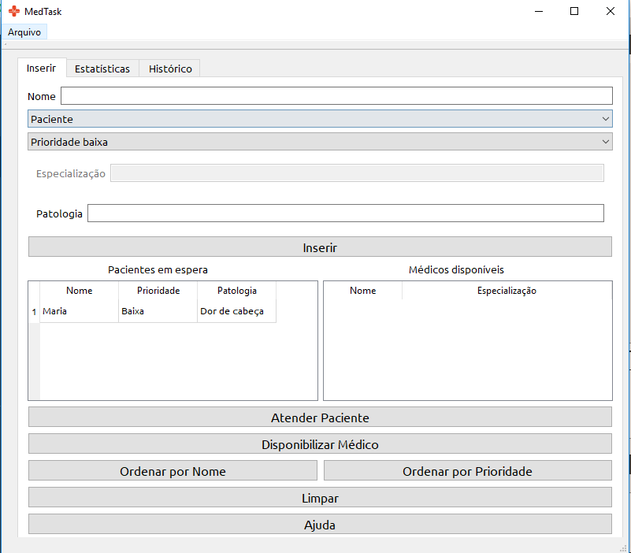
Ao clicar em Disponibilizar Médico, será aberta uma janela com a lista de médicos indisponíveis no momento, que podem ser disponibilizados novamente para exercer seu função. Basta clicar duas vezes no nome do médico e ele poderá ser posto novamente para trabalho.
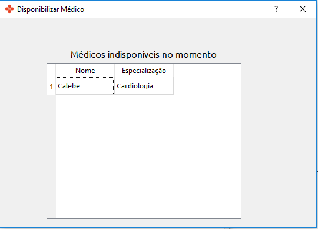
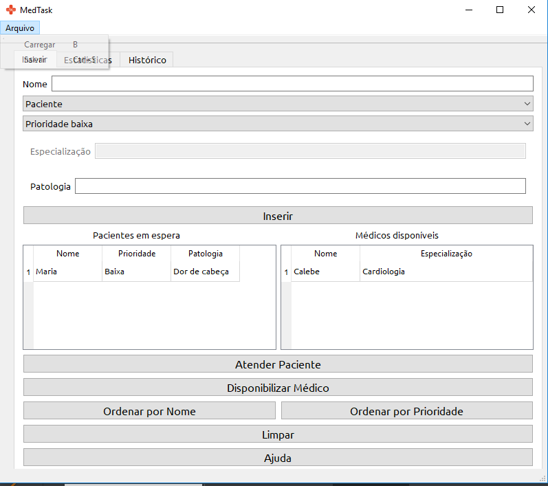
Às vezes há momentos que os cadastros podem ser feitos de maneira incorreta, como algum atributo do usuário ter sido escrito errado pelo cadastrador. Estes problemas podem ser resolvidos com a opção de editar o usuário, clicando duas vezes no aspecto a ser editado, ainda na tabela.
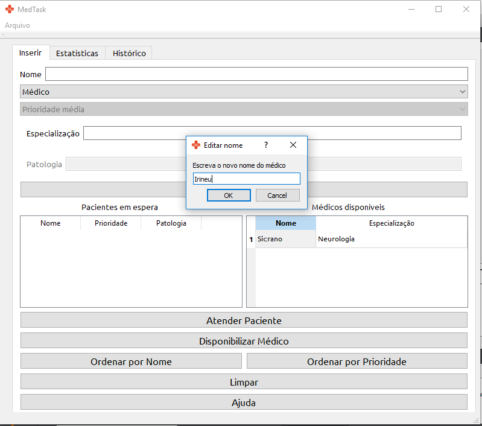
Esta opção pode ser com os dois tipos de usuários presentes no programa. 
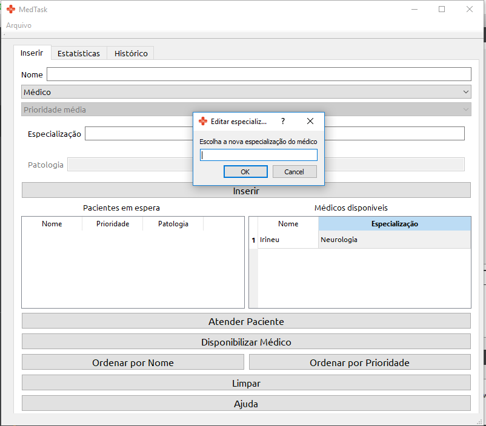
### Estatísticas
Ao ir na aba "Estatísticas", podemos verificar algumas estatísticas dos médicos. 
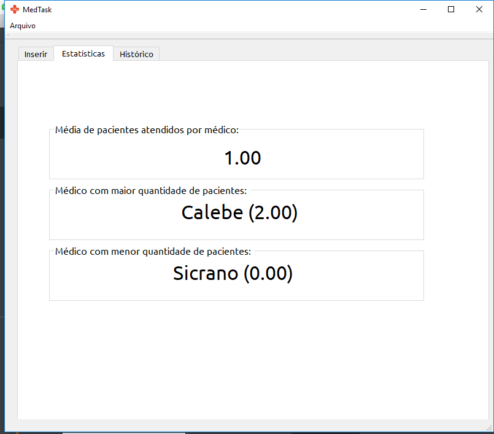
### Histórico
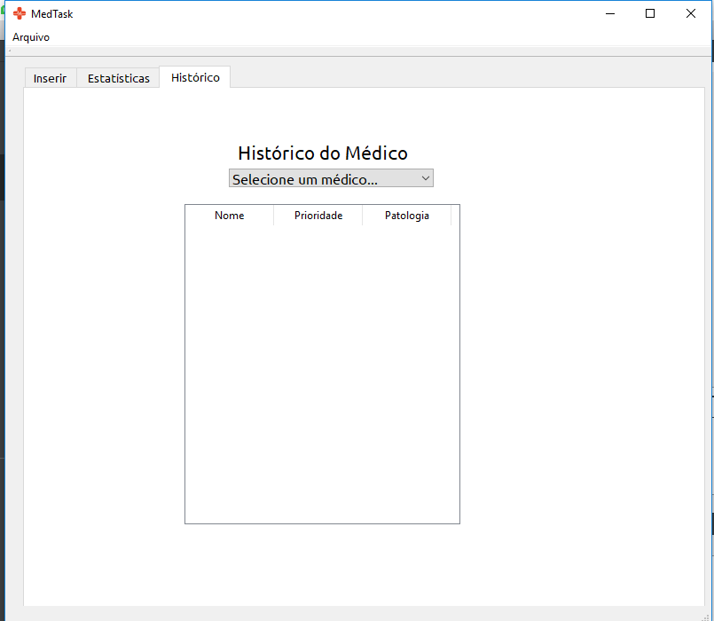
Na aba "Histórico", temos a opção de verificar o histórico de pacientes de cada médico, em uma tabela de registro de todos àqueles que já passaram por seus atendimentos. 
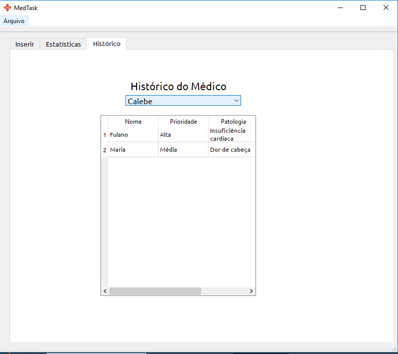
