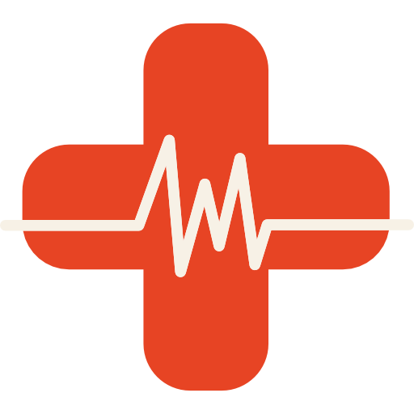

# MedTask
### Projeto desenvolvido com a framework QT Creator para a disciplina de Técnicas de Programação 2018.2. MedTask permite que você gerencie de maneira simples o atendimento de pacientes em um ambiente hospitalar. 

